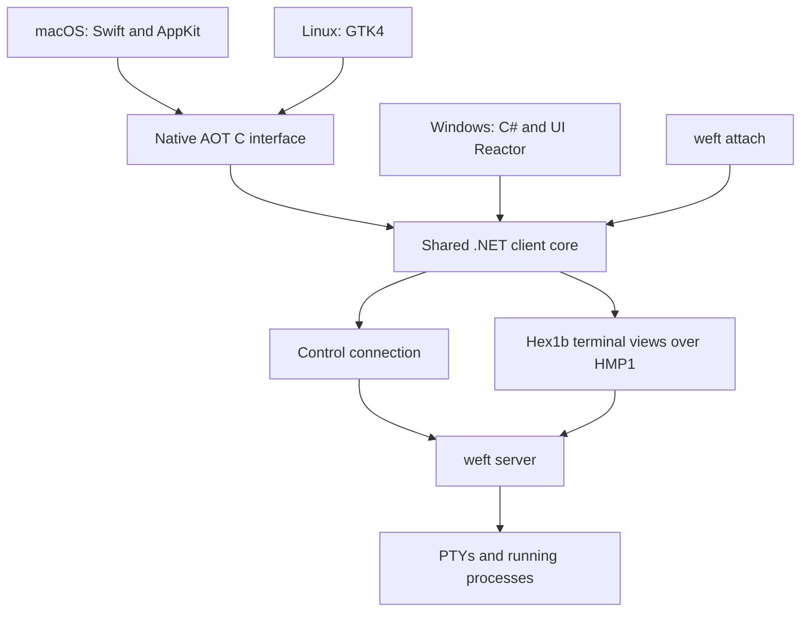

# Standalone desktop app

Status: native applications are the primary product direction. macOS is in progress;
Windows and Linux follow later. Installation currently targets local development and
testing, without store submission or signing credentials. This extends the
[weft design](design.md). Delivery is tracked in [progress.md](progress.md).
The [native app parity contract](desktop-parity.md) inventories implemented Mac
behavior and the corresponding Windows and Linux work, including native adaptations
and qualification that remains open.

## First macOS implementation

`native/Weft.Desktop.Mac` contains the Swift/AppKit frontend. `Weft.Client.Core`
now supplies the shared control connection, server launcher, logging, session
mirror, and desktop worker. `Weft.Client.Native` publishes the C interface.
The existing terminal client uses the extracted services as well.

Build with `dotnet run --file scripts/Build-MacApp.cs`. The script selects the host
architecture, or accepts `--arch arm64` and `--arch x64` after the usual `--`.
It creates `artifacts/macos/osx-<architecture>/Weft.app`, including the Native AOT
client library, CLI/server, and required native dependencies. The bundle resolves
its server by path and needs no installed .NET runtime. Its minimum macOS version
is derived from the bundled native binaries and written into its metadata.
Signing is local and ad hoc, with no certificate or account. The app version comes
from the repository's `VersionPrefix`. `Package-MacApp.cs` wraps the built app in a
disk image with an Applications link; it does not launch the app or change an existing
installation. `Test-MacApp.cs -- --package` mounts that image, copies the app to a
temporary Applications directory, unmounts it, and runs the native checks against the
installed library and server. Public distribution signing and notarization are deferred.
The package test also replaces, removes, and reinstalls that temporary app while its
server and shells keep running, then reconnects through the reinstalled library.

The GUI executable is `Weft`; its bundled server is `weft-server`. Their names
must remain distinct on case-insensitive filesystems. Packaging verifies that
compiling the GUI did not alter the server binary. The shared launcher rejects
an explicit server path that matches its caller, and the GUI rejects server
arguments before creating the application or any windows.

Native runtime validation uses one app instance and an isolated server for tests.
An initial packaging error used names differing only by case, overwrote the server
with the GUI, and caused recursive application launches. The distinct names,
binary identity checks, and startup guards are mandatory regression coverage.

The window has horizontal tabs in a compact native toolbar, a session menu,
a New Tab button, terminal actions, and macOS menus. The session menu creates and
switches sessions without stopping their processes. Pane headings identify the
terminal; subdued borders indicate focus. Connection errors appear only when needed.
Command+N opens another window, Command+T creates a tab, Command+W closes the
window, and Command+Q quits the app. Copy, Paste, and Select All use the standard
Edit menu actions. Escape, Control+B, and function keys go to the terminal.
Option text input uses macOS composition. The shared action catalog feeds menus and
command search. Renaming and terminating panes, tabs, and sessions use native sheets;
termination and input broadcasting require confirmation. Commands opens one search
panel and restores terminal focus when dismissed. Find searches retained terminal rows.

| Action | Default macOS shortcut |
| --- | --- |
| Commands | ⌘⇧P |
| Find in Terminal | ⌘F |
| New Tab | ⌘T |
| Split Right / Split Below | ⌘D / ⌘⇧D |
| Previous Tab / Next Tab | ⌘⇧[ / ⌘⇧] |
| New Window / Close Window | ⌘N / ⌘W |
| Quit | ⌘Q |
| Settings | ⌘, |

Other actions are available in menus and command search without a default direct
shortcut. Settings can record or remove a command shortcut and restore the defaults.
Recordings require Command and reject collisions with other actions or standard Mac
commands. Terminal control keys stay available without a prefix or persistent input mode.

Each window attaches through the existing session protocol. Closing it releases
its control and visible HMP1 connections without stopping workloads. Opening a
window attaches to the most recent session. Selection of tabs remains shared
between clients because that is the current server protocol's behavior.
The native bridge reads the user's Weft `shell` setting when a window opens and
passes it explicitly when creating sessions, tabs, and splits. Changing that
setting takes effect for new desktop terminals after reopening the window without
restarting the server or replacing any existing shell.

The worker accepts a bounded ordered command queue and retains only its latest
frame. Visible blocks use Hex1b's public terminal snapshot and presentation APIs.
Frames contain row-major graphemes, RGB colors, text attributes, geometry, and
cursor state. A Swift custom view draws the cells; there is no separate VT parser.
The ABI 4 bridge uses source-generated UTF-8 JSON metadata and a worker-thread notification.
Cells are value types encoded as compact arrays, with default styles omitted.
Each frame starts with a four-byte little-endian metadata length. Raw texture bytes
follow the metadata in block and texture order; placements share these resources.
The bridge writes directly into its owned allocation. Native texture slices keep that
buffer alive until their last image is released, avoiding intermediate pixel copies.
Pixel data is never expanded into base64 JSON strings.
A bounded Swift worker transfers and decodes frames, retaining only the newest
result for the main run loop, including native event-tracking modes.
Unregistering the callback drains any invocation before Swift releases its retained
context. Idle windows do not poll on a timer. Projection time counts toward the
maximum 120 Hz update interval, and input after an idle period wakes immediately. Native
views coalesce presentation independently, leaving headroom for 60 Hz producers. Completed
snapshots prevent partial synchronized redraws from reaching the view. Local output,
typing, scrolling, and graphics measurements live in the progress tracker; portable
performance budgets remain a release qualification task. Initial test limits and
their outstanding validation are recorded in [Mac qualification](macos-qualification.md).

The bundle includes regular and italic Cascadia Mono NF from Microsoft's latest
published Cascadia Code release, with its license and source hash. Fonts are
registered for the app process only. View → Choose Font uses the native font panel
and retains a monospaced selection; bundled symbols remain available as fallback.
Rendering clips to each terminal view and cell, including wide glyph continuations.
Private-use symbols retain interior detail through outline rendering. The native
test checks rendered pixels as well as glyph availability. The macOS preference
domain `dev.weft.desktop` stores `terminalFontName`, `terminalFontSize`, and optional
six-digit RGB values for `terminalBackground`, `terminalForeground`, and
`terminalCursor`. These control the app's appearance; shell prompts remain user
shell configuration. The terminal font panel persists the selected font and size.
Native Settings exposes the three colors and command shortcuts. An original woven W
icon is rendered from vector drawing code into the bundle's icon sizes during packaging;
icon generation exits before constructing the application or a window.

Text composition uses AppKit's `NSTextInputClient`. History scrolls through a retained
snapshot with a 10,000-row cap and a lower starting capacity for wide terminals. Wheel scrolling
and a native scrollbar expose it without changing the running process. Scrollbar
page steps use terminal rows; native thumb tracking remains continuous,
and page clicks cannot leave an animation competing with a later drag. Selection
retains the displayed cells while output continues; typing or Resume follows live
output again. Double-click selects a word, triple-click selects a row, and Copy uses
the retained text. Application mouse events use the core's negotiated encoding;
Shift allows selection when the application owns the mouse. Command-click opens
HTTP, HTTPS, or mail links supplied through OSC 8. Pane dividers can be dragged.

Kitty images share their texture across placements, including cropped sprite atlases.
The decoded budget counts each image once, with a separate 16,384-placement limit.
Animated images use the current presentation frame. Native-sized placements preserve
fractional cell bounds on the session's canonical 10×20 graphics grid; each frontend
scales that grid to its font and display. Sixel output is composited from newest to
oldest into one bounded visible plane, so hidden historical frames cannot consume
the transfer budget before the current frame. Coverage checks skip hidden images
before their pixel buffers are materialized, and row spans avoid a second crop buffer.
Opaque, unscaled front images use bulk row copies after vectorized alpha checks.
The composition buffer is allocated only when needed; opaque copies initialize
their destination directly and only the surrounding transparent area is cleared.
Desktop terminal retention is bounded to 64 MiB for each of the main and alternate
screens and 8,388,608 logical pixels, reserving room for sparse and dense storage;
the independent 16 MiB projection budget limits a visible block's resources.
Fully covering crops reuse their source identity. Swift draws cached Core Graphics
images directly and clips them to their placements. The cache discards images
absent from the current frame and retains at most 256 images and 32 MiB of decoded
row storage. Shared frame buffers and compositor surfaces are measured separately;
the cache bound is not a process memory budget. Terminal output cannot name files
for the app to load.

Lost control connections retain known content with a reconnect message, reject new
input while disconnected, and discard queued uncertain commands. Reattachment keeps
the original shell process. A deleted session returns to an empty window with session
selection and creation available. A protocol mismatch explains that the running server
must be explicitly restarted after finishing work; app startup never replaces it.

Interactive VoiceOver, input-method candidate windows, physical keyboard layouts,
and movement between different physical displays remain qualification work.
Selection across viewports, composition replacement and cancellation, installed
French/German/Spanish layout translation, graphics animation, cropping, offsets,
and fractional placement have automated coverage.
Swift DocC comments
describe native boundaries, ownership, threading, and non-obvious behavior; routine
AppKit overrides and self-explanatory properties do not need repetitive comments.

`dotnet run --file scripts/Test-MacApp.cs` compiles the production AppKit sources
into a native smoke harness and uses the published C library and bundled server.
It starts an isolated server, sends a native key event to a real shell, checks
Unicode, prompt symbols, and colors, renders the view to a PNG, verifies narrow
toolbar layout, creates a split and tab, creates and switches sessions through
native controls, checks retained history, Find, command-panel lifetime, raster pixels,
and closes and reattaches a window. Test windows do not restore or save user window
placement. The .NET integration tests also verify raw
Escape, Control+B, and F1 bytes and preservation of shell process identities.
CI builds and runs the native test on ARM64 and Intel macOS runners.

## Visual and interaction acceptance

The first window opens directly into a readable local terminal. Tabs, session
selection, and New Tab share one compact top bar with native window controls.
Selected tabs have a restrained background, long titles truncate, and overflowing
tabs remain reachable by scrolling. Pane headings and subtle borders identify
focus without competing with terminal content. Persistent explanatory footers and
empty control bands have no place in the working surface.

Prompt icons, Powerline separators, combining characters, wide text, and emoji must
render correctly at normal and enlarged sizes. Font fallback preserves the terminal
grid. Native window captures at narrow and wide sizes are part of validation;
passing a cell-state test alone does not establish rendering correctness.

Scrolling should work with a trackpad, wheel, and native scrollbar without entering
a terminal mode. Selection, clipboard, input composition, and accessibility must
remain usable while output arrives. Command search and menus expose the same
actions. Existing platform shortcuts are shown beside their commands; the complete
shortcut map requires review before adding bindings. An optional session sidebar
can follow once horizontal navigation is complete.

The native accessibility adapter exposes UTF-16 text, line and selection ranges,
and screen coordinates from the same cells it paints. It is registered as a text
area in the external macOS accessibility tree. Accessible selection changes the
highlight without moving the process cursor, and exposed output is not editable.
Composition stays with its originating pane and is cancelled when focus moves.
The default cursor blinks only while its terminal has keyboard focus. Input restarts
the blink interval; composition, steady cursor styles, hidden windows, and Reduce
Motion suspend it. Only the caret cell needs repainting for a blink.
Automated composition tests cover exact Unicode bytes reaching a real PTY.
These API tests do not establish interactive VoiceOver or input-method coverage.

Visual polish is one acceptance condition. Release also requires measured input
latency, frame pacing under sustained output, idle wakeups, memory growth, and
reattach time. Repeated window opening, session switching, and closing must preserve
workloads and release client resources. Historical scrolling has native smoke
coverage; the full performance and compatibility matrix remains a release gate.

## Purpose

Add a standalone desktop application alongside `weft attach`. Both clients connect to
the same server and operate on the same sessions. Opening the desktop app should feel
like opening a terminal: a usable prompt, visible tabs, familiar menus, and ordinary
selection and scrolling. Closing the app leaves workloads running.

Use native interfaces for each operating system and share the connection, command,
and terminal interaction logic in .NET. Platform differences belong in the interface
and its adapters; session semantics remain common.

## Platforms

| Platform | Interface | Required CPU targets |
| --- | --- | --- |
| macOS | Swift and AppKit, with SwiftUI where useful | ARM64 Apple Silicon and x64 Intel |
| Windows | C# and Microsoft UI Reactor over WinUI | ARM64 and x64 |
| Linux | GTK4 with a small native frontend, initially C | ARM64 and x64 |

[AppKit](https://developer.apple.com/documentation/appkit) supplies macOS window,
menu, input, and accessibility integration. [Reactor](https://github.com/microsoft/microsoft-ui-reactor)
authors real WinUI controls in C#. [GTK4](https://docs.gtk.org/gtk4/running.html)
provides Wayland and X11 backends; test both. Linux desktop conventions vary, so GTK
integration does not imply an identical appearance across GNOME and KDE.

These are release targets, not claims of existing support. ARM means ARM64 here;
32-bit ARM and x86 are outside the initial scope. Minimum operating-system versions
will follow the supported intersection of .NET, the interface toolkit, and native
dependencies, and will be recorded in release metadata after validation.

Musl is an additional Linux C-library target, independent of CPU architecture. Start
with `linux-musl-x64` and `linux-musl-arm64` server and CLI validation. A desktop musl
package is optional and requires its own GTK, graphics, font, and PTY dependency
checks. It must not be advertised based on a successful glibc build.

## Shared architecture

The server remains a separate process and owns sessions, layouts, PTYs, terminal
state, and retained history. Desktop launch uses the existing on-demand server
startup path. App exit, window closure, or a client crash must never kill the server
as a consequence of parent-process ownership or a Windows job object.

The shared client core owns control requests, subscriptions, session mirrors,
command execution, reconnect handling, and terminal view lifetimes. Extract that
logic from `Weft.Client` incrementally, preserving the terminal client's behavior.
Views continue to use Hex1b and HMP1 through public APIs. Weft adds desktop
presentation and input adapters; it does not add another terminal parser.

Proposed organization within this repository:

| Component | Responsibility |
| --- | --- |
| `src/Weft.Client.Core` | Platform-neutral client services and command catalog |
| `src/Weft.Client.Native` | Native AOT exports for Swift and C consumers |
| `src/Weft.Desktop.Windows` | Reactor components and Windows terminal presentation |
| `native/Weft.Desktop.Mac` | AppKit interface and macOS presentation |
| `native/Weft.Desktop.Linux` | GTK interface and Linux presentation |
| Existing server, protocol, CLI, and TUI projects | Shared session services and existing entry points |

The Windows app references the managed core directly and publishes it with the app.
It does not load a second Native AOT copy of the core. Swift and C consume a shared
library with C-compatible exports, supported by [.NET Native AOT](https://learn.microsoft.com/en-us/dotnet/core/deploying/native-aot/libraries).
Keep the interface narrow: opaque handles, explicit byte lengths, UTF-8 text,
asynchronous operations, and matching release functions for owned buffers.

Version the interface and check compatibility before attaching. Exceptions become
explicit error results. Callbacks have documented thread and lifetime rules; UI work
is dispatched to the platform's UI thread. Disposal cancels operations and drains
callbacks before releasing handles. Load the library for the lifetime of the app;
Native AOT library unloading is not supported.

Each window owns its attachments and views. Window placement, sidebar visibility,
and recently opened sessions are client preferences. Server-owned layout and current
selection semantics remain authoritative. Independent selection of tabs by different
clients would require an explicit protocol change, not a private desktop workaround.

## Terminal presentation

The read-only Ghostty and kitty reviews reinforce four choices: follow established
terminal behavior, use native platform controls, keep input and protocol processing
independent of painting, and measure latency, throughput, and idle resource use
separately. A parser benchmark does not establish responsive drawing. Weft keeps its
existing terminal engine and applies these principles to the desktop adapter.

Selection uses a stable history snapshot owned by the shared core. The native
gesture tracks pointer movement and word or line granularity, while the core owns
cell bounds and copied text. Edge autoscroll runs only during a held drag. Rendering,
copy, and accessibility consume the same selection, even when process output arrives.
Changing geometry clears the retained snapshot until reflow-aware anchors are supported.

Build a desktop terminal surface for each frontend around a common view model. The
model carries terminal cells and attributes, cursor state, selection, history position,
and graphics placements. Platform adapters handle drawing, font shaping, input methods,
clipboard access, pointer events, and accessibility.

Start by proving a real HMP1 attachment can render and accept input using the chosen
published Hex1b package. Public snapshots can establish correctness in the prototype;
measure copying and allocations before choosing the production update path. Keep
rendering outside general-purpose UI reconciliation and avoid a UI control per cell.
The renderer must preserve terminal cell widths while supporting font fallback,
combining characters, emoji, links, and terminal graphics.

The Mac implementation uses CoreText and CoreGraphics in a retained AppKit surface.
Candidate paths for Windows and Linux are a hosted DirectX/DirectWrite surface and
GTK's drawing facilities, respectively. Select those backends from working prototypes
and measurements. The GUI framework alone does not establish renderer performance
or terminal compatibility.

Keep PTY and protocol processing independent of painting. Coalesce redraw requests
without discarding terminal updates, bound queued work, and redraw only affected
regions where practical. Hidden views follow the visibility and cache limits in the
main design. Graphics resources and subscriptions are released when views close.

Native scrollbars and mouse selection operate on terminal history without requiring
a keyboard mode. History from before attachment needs explicit integration with the
server's history API; the existing TUI's history behavior does not prove this works
in a desktop view. Verify ordering, resize behavior, and overlap with live output
before promising seamless scrollback. Selection, accessibility, and drawing must
refer to the same terminal content.

## Windows with Microsoft UI Reactor

Use the latest published preview of
[`Microsoft.UI.Reactor`](https://www.nuget.org/packages/Microsoft.UI.Reactor).
Consult its [latest documentation](https://microsoft.github.io/microsoft-ui-reactor/latest/)
and verify APIs against the published package when implementation begins; a local
checkout may contain unreleased changes. The checkout is a read-only reference,
not a project reference or a source of locally built packages.

Resolve the newest listed preview when adding or updating the dependency. Record
the resolved package version only in `Directory.Packages.props`, with a versionless
`PackageReference` in the Windows project. Dependency updates continue to follow previews;
do not freeze an older preview to avoid a build failure. Optional Reactor packages
must use matching releases when required. No SDK or tool version pins are introduced.

Author the window interface as C# Reactor components. Project shared command
definitions into Reactor commands so menus, buttons, the command palette, enabled
state, and displayed accelerators agree. Its
[commanding model](https://github.com/microsoft/microsoft-ui-reactor/blob/main/docs/guide/commanding.md)
supports focus-scoped and window-scoped accelerators; scope must be chosen deliberately
so text fields and terminal input retain their expected behavior.

Host the terminal surface as a stable native control with explicit lifetime management.
Terminal output invalidates that surface rather than updating component state for every
cell or output chunk. Use stable session, tab, and block IDs when reconciling interface
elements. Keep Windows types and Reactor hooks out of the shared core.

Publish and run Native AOT builds for both Windows architectures. The
[Reactor AOT support matrix](https://github.com/microsoft/microsoft-ui-reactor/blob/main/docs/aot-support.md)
distinguishes supported features from reflection-dependent paths. Use explicit metadata
and registrations where required, and keep developer inspection features out of release
builds. Verify control metadata, theme resources, and packaged resources in the actual
published app. Compilation alone is insufficient. Fix integration problems without
adding diagnostic suppressions or changing reference repositories.

## Commands and input

Provide visible session selection, tab controls, New Tab, a searchable Commands menu,
Help, and Quit or Exit. Every action is discoverable and keyboard-accessible through
menus or command search. The terminal area receives focus when a session opens.

A shared command catalog supplies identity, label, arguments, enabled state, and scope.
Platform-specific mappings supply shortcuts. All interface surfaces derive their labels
and bindings from that mapping. A missing direct shortcut is explicitly represented;
it is not an accidentally empty field. Review the complete command and shortcut table
for each platform before implementing defaults. The current TUI's function keys are
not adopted as desktop defaults by this document.

Use platform conventions without requiring vi motions, a memorized prefix sequence,
or a persistent mode to recover normal terminal keys. Application shortcuts are
consumed once; unhandled input reaches the terminal with its modifiers intact. System
shortcuts remain under operating-system control. Conflicts require a deliberate
mapping or configurable alternative, not a claim that any key is universally free.

Clipboard and editing commands follow focus. For example, ordinary `Ctrl+C` in a
Windows or Linux terminal must still interrupt the process; a desktop Copy command
must not accidentally consume it. Validate text composition, dead keys, AltGr,
non-US layouts, key repeat, bracketed paste, and application mouse reporting.

Commands opens one panel and focuses its search field. Closing it restores the prior
focus. Esc dismisses the active dialog or menu; with the terminal focused it goes to
the terminal. Esc never exits the application.

Closing a window detaches its views. Quit or Exit closes this client and leaves all
sessions and processes running. Reopening restores the last session when it still
exists. Closing a block or session is a separate server operation; label its effect
clearly and confirm termination of running work. Lost connections show reconnect
state, retain known content as stale, and never replay uncertain input or destructive
commands automatically.

## Builds and distribution

Shared managed projects target .NET 11 and stay Native AOT compatible. The Windows
frontend uses the corresponding Windows target and an explicit x64 or ARM64 platform.
Native interfaces use their platform toolchains. Repository automation remains
file-based C# under `scripts/`, invoking those toolchains as needed.

Keep platform UI projects out of the portable default solution build. Add platform
solutions or solution filters that include the shared projects and the relevant native
frontend. A normal `dotnet build` must remain meaningful on every development OS;
CI also builds each platform's complete application.

| Platform | Local installation plan |
| --- | --- |
| macOS | App bundle in a drag-to-Applications DMG, with an automatic ad hoc signature and no certificate or notarization. Build ARM64 and Intel bundles; validate every native slice before adding a universal bundle. |
| Windows | Unsigned development MSIX for x64 and ARM64, with real package identity, resources, Start menu integration, and uninstall behavior. Use the Windows 11 unsigned-package development path; it requires administrator installation for executable packages. |
| Linux | Local `.deb` and `.rpm` packages for glibc systems, with desktop entries, icons, and explicit GTK/native dependencies. No signed repository is required for local package testing. Musl desktop packaging remains optional. |

Keep local packages structurally close to eventual releases: normal metadata, icons,
native dependencies, installation paths, and uninstall behavior. No store accounts,
certificate generation or trust-store changes, notarization submission, or automatic
update service is required for this stage. Never force-stop sessions during install,
upgrade, or uninstall tests; defer replacement when the platform requires a process
to exit. Removing the application does not remove user configuration or session data.

Apple's [ad hoc signature](https://developer.apple.com/documentation/security/seccodesignatureflags/adhoc)
uses no signing identity. Windows supports
[unsigned development packages](https://learn.microsoft.com/en-us/windows/msix/package/unsigned-package)
with a dedicated publisher OID and `AllowUnsigned`; that development identity differs
from a later signed identity. Implement the Windows install helper in C# using platform
deployment APIs and document its privilege requirement when the Windows frontend lands.
Do not require testers to create or trust a certificate.

Public distribution is a later milestone. Revisit Developer ID and notarization,
Windows package signing, repository signing, and update channels then. Store submission
is not a current goal and does not gate local development.

Bundle a compatible server and identify protocol compatibility on connection. An
application update must not silently stop or replace a running server with active
workloads. Existing sessions continue on that server; incompatible clients explain
the mismatch and require an explicit server restart. Launching the app must not depend
on the user's interactive shell PATH or working directory.

[Native AOT builds use the target OS's toolchain](https://learn.microsoft.com/en-us/dotnet/core/deploying/native-aot/cross-compile).
Build on macOS, Windows, and Linux workers and run the resulting applications on the
claimed CPU targets. Emulated runs are useful additional coverage, not proof of native
ARM64 support. Record toolchain versions in CI output without exact SDK pins.

## Delivery and verification

The shared client boundary and first Mac implementation are in place. Finish Mac
qualification, then implement Windows and Linux in that order using the
[parity contract](desktop-parity.md). Begin each port with a minimal window that
attaches to a real session, renders output, accepts input, resizes, closes, and
reattaches to the same process. Prove published Native AOT integration at this stage.

Before expanding the interface, validate selection, historical scrollback, Unicode,
input methods, clipboard, graphics, and accessibility on those terminal surfaces.
Then implement the shared command catalog, reviewed shortcut mappings, session and
tab controls, splits, command search, and window restoration. Packaging and platform
automation must land alongside the clients, not after a platform is declared supported.

Acceptance requires real applications, servers, PTYs, and transports:

- A GUI and TUI can attach to the same running session; disconnecting either preserves
  process IDs and output in the other. GUI quit and forced termination are both covered.
- Commands work from menus, search, and configured shortcuts; dialogs restore focus,
  shortcuts execute once, and terminal input remains correct under each focus state.
- Multiple windows, display scaling changes, font changes, resize, and hidden tabs do
  not corrupt content or retain unbounded view resources.
- Published Native AOT packages launch on clean target systems, retain resources and
  accessibility metadata, and reconnect correctly after app updates.

Use platform UI automation for desktop windows and the existing Hex1b tooling for
the TUI. C# tests remain MSTest with Microsoft.Testing.Platform; run the portable suite
with `dotnet test --solution Weft.slnx` and equivalent platform solution suites on their
own workers. Do not replace production services with mocks or change parallelization
to hide lifecycle defects.

Measure cold launch, warm reattach, input-to-paint latency, output throughput, idle
wakeups, memory per view, and memory after view churn on each platform. Separate GUI,
server, and child-process costs. Establish regression budgets from those measurements;
the existing CLI executable-size budget does not describe a desktop app bundle. No
telemetry is added.

`Test-MacApp.cs -- --profile-memory` measures a fresh native client process against an
isolated server, closes five client windows, and captures `vmmap` and `heap` reports
during a bounded pause. It does not reuse the process that captured smoke-test bitmaps.
The initial local profile retained 24.9 MiB in backing layers after closure; explicit
window teardown reduces that to under 0.1 MiB. Compact cells and decoding without a
second byte copy further reduce temporary frame allocations. Physical footprint in
the same scenario fell from 141.5 to 87.6 MiB. Resident size and physical footprint
are different measurements; neither includes the separate server and shell processes.
These samples establish a repeatable investigation, not a cross-machine release budget.
